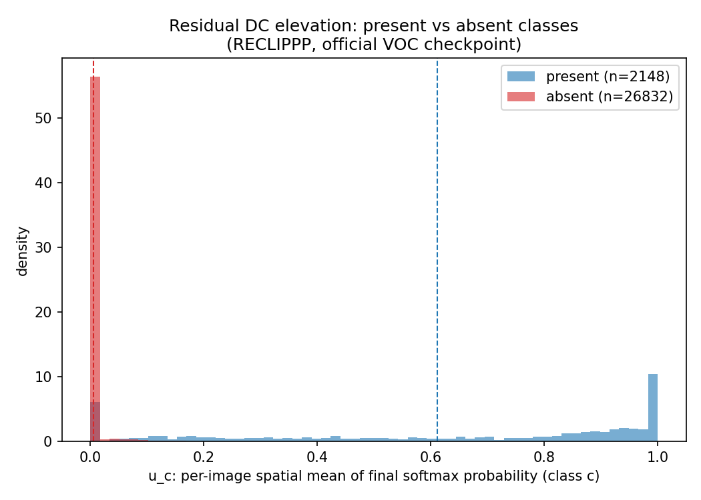

# Diagnostic: Image-Dependent Residual Bias After Static Bias Subtraction

## Premise

ReCLIP++ (RECLIPPP) computes `bias_logits = pe_proj(positional_embedding) @ prompt.T`
inside `RECLIPPP.forward` (`model/model.py`). `positional_embedding` here is the ViT's
(interpolated) positional embedding grid -- it does not depend on image content, so
`bias_logits` is the same functional bias for every image (only image content enters
through `output_q`). The model then computes
`output = output_q - bias_logits`, followed by a small decoder conv/BN
(`decoder_conv2` + `decoder_norm2`) on `concat(feat, output)`.

Hypothesis: after this static-bias subtraction (and the decoder on top of it), the
FINAL per-pixel, per-class probability map still carries a spatially-uniform ("DC")
elevation for classes that are NOT actually present in the image (class
hallucination / residual bias), and this elevation varies across images
(image-dependent). If true, a static (image-independent) subtraction structurally
cannot remove it -- this is the headroom a future method would target.

## Method

- Model: `RECLIPPP` (`model/model.py`), official checkpoint
  `experiments/official/voc_reclippp_854/best_weight.pth`, config `config/voc_test_official854_cfg.yaml`.
- Built and run EXACTLY as `tools/test.py` (`build_model`, `val_preprocess`, PD
  filtering with `cfg.TEST.PD`, double bilinear interpolation to original image
  resolution, final `F.softmax(output, dim=1)`). The tensor analyzed is the one
  `tools/test.py` line 203 feeds into `torch.argmax` -- i.e. the actual per-pixel
  class-probability map that determines the prediction -- captured BEFORE argmax,
  instead of the post-argmax label map `tools/test.py` saves to disk.
- Full VOC2012 val set (1449 images), C=20 classes
  (VOC foreground classes only; background/ignore excluded via
  `DATASET.REDUCE_ZERO_LABEL`).
- Per image, per class c: `u_c` = spatial mean of the probability channel c over
  valid (non-ignore) pixels ("DC" / uniform component); `p_c` = spatial 95th
  percentile of channel c ("peak"); `gap_c = p_c - u_c` (peakedness).
- GT is used ONLY to label each class, per image, as present (appears in that
  image's GT) or absent. This is legitimate for this diagnostic -- it
  characterizes the failure mode, it is not a training signal and does not gate
  anything. The eventual method motivated by this diagnostic will be unsupervised
  (GT-free) at inference time.

## Raw numbers

| # | Quantity | Value |
|---|---|---|
| (a) | mean u_c, PRESENT classes | 0.611776 |
| (a) | std u_c, PRESENT classes | 0.359772 |
| (a) | mean u_c, ABSENT classes | 0.005028 |
| (a) | std u_c, ABSENT classes | 0.037432 |
| (b) | median across-class of (per-class across-image std of u_c, ABSENT-class occurrences) | 0.031382 |
| (b) | top-5 classes by this across-image std | see below |
| (c) | mean peakedness gap_c, PRESENT classes | 0.197449 |
| (c) | std peakedness gap_c, PRESENT classes | 0.219248 |
| (c) | mean peakedness gap_c, ABSENT classes | 0.006276 |
| (c) | std peakedness gap_c, ABSENT classes | 0.038020 |
| (d) | Pearson r(mean u over absent classes, per-image error) | 0.730183 |
| (d) | n images used for (d) | 1449 |
| (d) | error metric used | per-image error = 1 - pixel accuracy on valid (non-ignore) pixels (== FP-pixel fraction) |
| (e) | fraction of FP pixels from ABSENT-with-elevated-DC classes | 0.071470 |
| (e) | FP pixels from elevated-absent classes / total FP pixels | 350681 / 4906706 |

Top-5 classes with highest per-class across-image std of u_c (measured only over
images where that class is absent) -- (b):
```
  1. person: std=0.073233
  2. sofa: std=0.065827
  3. dining table: std=0.053986
  4. boat: std=0.049779
  5. sheep: std=0.049091
```

Note on (e): "elevated" is defined as `u_c >= mean(u_c over PRESENT classes,
dataset-wide)` (row (a), 0.611776) for an absent class c in a
given image -- i.e. the absent class's spatial-mean probability in that image is at
least as high as a typical present class's spatial-mean probability dataset-wide.

## Figure



Histogram of `u_c` (per-image spatial mean probability) for present classes
(blue) vs absent classes (red), overlaid, density-normalized. Dashed lines mark
the two group means.

## Honest read

SUPPORTED: absent classes have mean u_c = 0.005028 vs present
classes' 0.611776 (row a); the median per-class across-image
std for absent-class occurrences is 0.031382
(row b), meaning the residual DC level for a given absent class is not a fixed
constant but varies image-to-image by roughly that much, which a static
(image-independent) bias subtraction cannot track; present classes are
substantially more peaked than absent classes (gap_c row c); the per-image
correlation between mean-u-over-absent-classes and per-image error is
r=0.7302 (row d); and 7.15%
of all false-positive pixels are attributable to absent classes whose DC level in
that image reached typical present-class levels (row e). Read these numbers
together, not any single one in isolation, to judge whether the headroom is
sizeable enough to justify a dynamic (image-dependent) bias-correction method.
