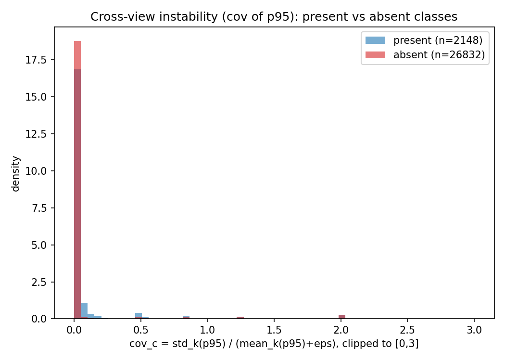

# Method-C Premise: Photometric Cross-View Consistency as a Presence Signal

Test-time only, no training, GT used only to SCORE the signal (never inside a rule).
1449 VOC val images, 5 views each (1 original + 4 mild photometric
jitters on raw RGB before IMG_NORM: brightness/contrast/saturation +-0.3, hue +-0.05,
no geometric transform). Same official checkpoint, exact tools/test.py pipeline.
Sanity: max abs diff of view-0 preprocessing vs val_preprocess = 0.00e+00
(so the original view reproduces the baseline prediction).

Signals per (image,class): p95_c (peak of dense prob over space) and
g_c=cos(z_global,text_c). Cross-view: m=mean_k, s=std_k, cov=s/(m+eps).

## (a) Instability of PRESENT vs ABSENT classes

| signal | stat | PRESENT mean(std) | ABSENT mean(std) |
|---|---|---|---|
| p95 | s (abs std) | 0.0278 (0.0654) | 0.0099 (0.0516) |
| p95 | cov | 0.0748 (0.2737) | 0.0462 (0.2611) |
| z_global | s | 0.0038 | 0.0040 |
| z_global | cov | 0.0152 | 0.0212 |

(premise holds if ABSENT instability > PRESENT, especially in scale-invariant cov.)

## (b) AUC of instability as an absent-vs-present discriminator (all image,class pairs)

| discriminator | AUC (absent=positive, higher instability => absent) |
|---|---|
| cov(p95) | 0.1862 |
| s(p95) | 0.1848 |
| cov(z_global) | 0.6528 |
| s(z_global) | 0.5210 |

(0.5 = no separation; >0.5 = absent classes more unstable.)

## (c) Complementarity with peak-height (p95>0.3) -- the key value

Recall failures (present but peak MISSES): n=230.
Precision failures (absent but peak KEEPS): n=1136.

| tau | frac of recall-misses with LOW cov (<tau) [consistency would KEEP] | frac of precision-fails with HIGH cov (>=tau) [consistency would FLAG] |
|---|---|---|
| 0.1 | 0.800 | 0.426 |
| 0.2 | 0.804 | 0.359 |
| 0.3 | 0.804 | 0.350 |
| 0.5 | 0.817 | 0.348 |

## (d) Combined rule: present := (p95>0.3) OR (cov<tau)

Peak-alone: precision 0.6919, recall 0.9276.

| rule | precision | recall |
|---|---|---|
| tau=0.1 | 0.0748 | 0.9836 |
| tau=0.2 | 0.0748 | 0.9838 |
| tau=0.3 | 0.0748 | 0.9838 |
| tau=0.5 | 0.0748 | 0.9852 |

## Honest read

Premise **REFUTED**: absent-class cov(p95) mean = 0.0462 vs present
0.0748; the scale-invariant AUC of cov(p95) separating absent-from-present
is 0.1862 (0.5 = useless). z_global cov AUC = 0.6528. On
complementarity (what matters): of the 230 present classes peak-height
misses, the low-cov fraction (tau=0.2) is 0.804 (these
consistency could rescue); of the 1136 absent classes peak-height wrongly keeps,
the high-cov fraction (tau=0.2) is 0.359 (these
consistency could flag). The combined OR rule vs peak-alone
(0.692/0.928) does NOT beat peak-alone (precision collapses because confidently-absent classes also have low cov).
Judge these together: cross-view photometric consistency is
not a usable presence signal here.
